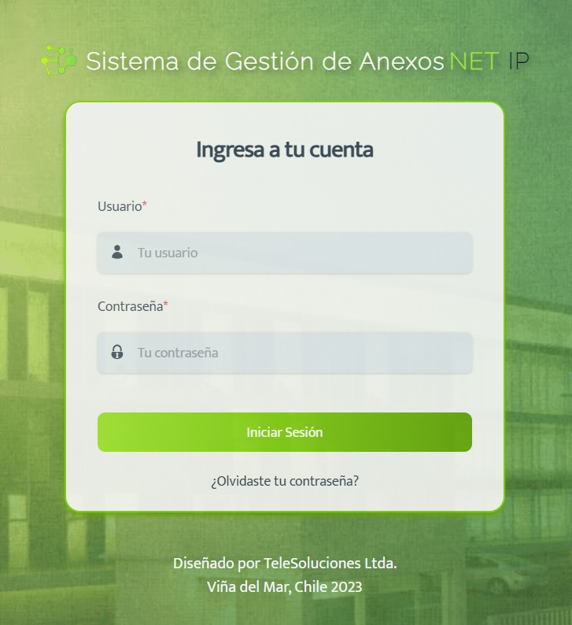
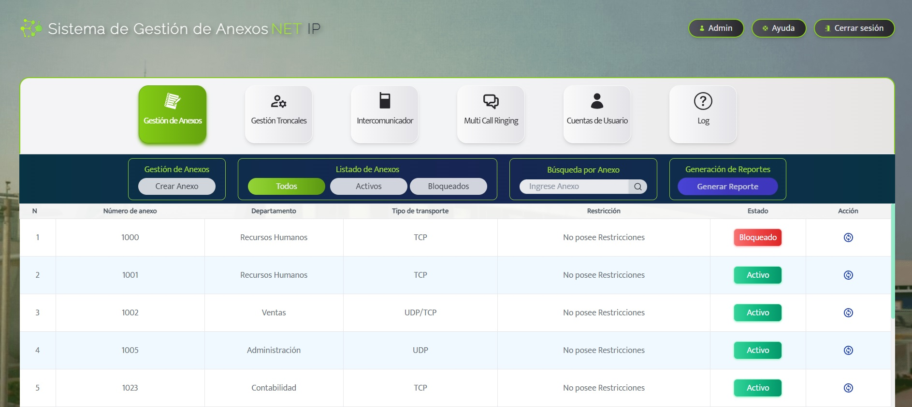
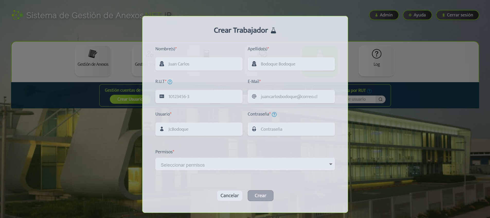
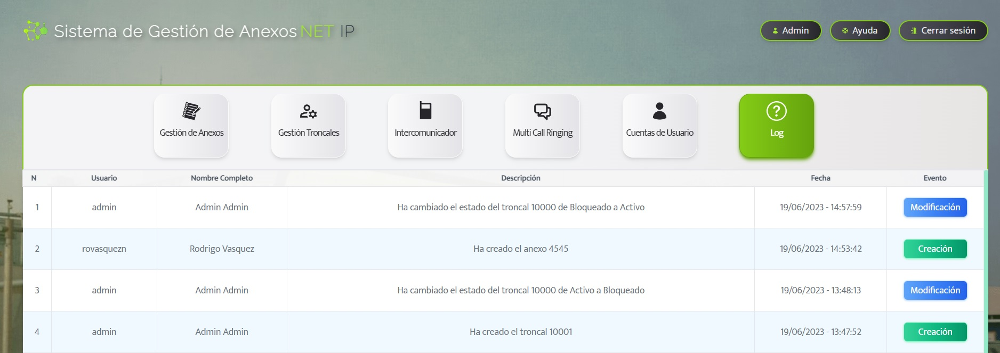
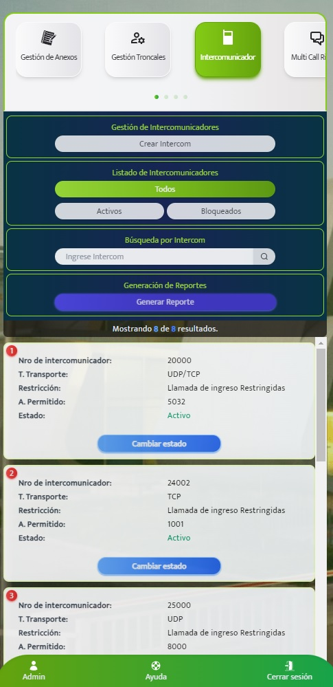
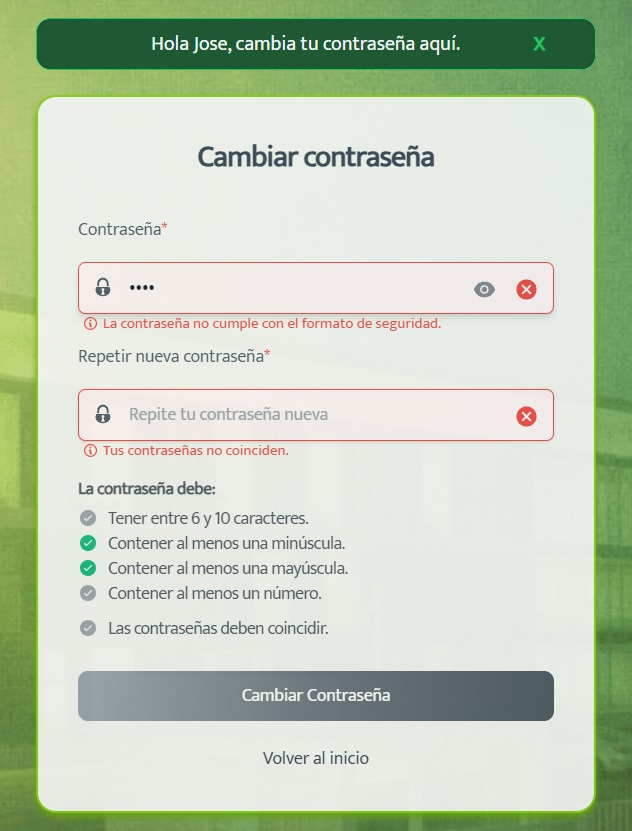

# Frontend aplicación de central telefónica "NET-IP"

## Descripción

Frontend de aplicación web responsive que permite administrar una central telefónica de manera eficiente. Esta aplicación abarca la *gestión* de **anexos**, **troncales**, **intercomunicadores**, **multi call ringing**, así como la administración de los **usuarios** encargados de operar el sistema.

## Tecnologías utilizadas

- React
- Vite
- Tailwind CSS
- Redux
- Material-UI

## Capturas de pantalla
*Login*

*Home*

*Crear trabajador*

*log*

*Vista responsive*

*Cambiar contraseña*

## Instalación
Antes de proceder con la instalación de este repositorio, asegúrese de tener completamente operativo el backend. Una vez que esté listo con el backend, puede proseguir con los siguientes pasos sin problemas.

1. Clonar el repositorio: `https://github.com/peperiqueelmee/--DUOC---Project_Title.git`
2. Navegar hasta el directorio del proyecto: `cd --DUOC---Project_Title`
3. Instalar las dependencias: `npm install`

## Configuración del entorno

Crea un archivo llamado ".env" siguiendo la estructura proporcionada en el archivo "example.env".

## Configuración del backend

Indica la URL donde se encuentra alojado el backend de la aplicación asignando el valor correcto a `VITE_BACKEND_URL` en el archivo ".env".

## Uso

Una vez realizadas las configuraciones anteriores, puedes arrancar el servidor utilizando el siguiente comando:
`npm run dev`

## Live Demo
Puedes ver la aplicación en vivo en [https://net-ip.netlify.app/](https://net-ip.netlify.app/).